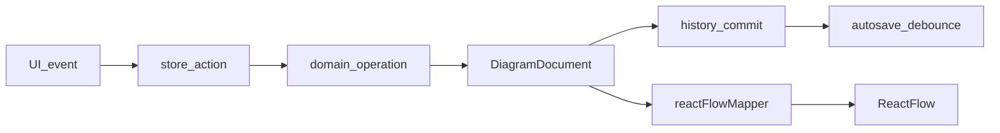

# Arquitectura

Arquitectura mínima: cuatro límites claros, sin Clean Architecture ceremonial, sin buses globales y sin capa DTO duplicada hasta que exista backend.

```text
UI (React)
  → acciones semánticas
Application / editor store (Zustand)
  → operaciones puras
Domain (DiagramDocument)
  → proyección memoizada
Rendering adapter (React Flow nodes/edges)
  → persistencia / exportación
Infrastructure (DiagramRepository, exportDiagram)
```

## Principio

`DiagramDocument` es la fuente de verdad. React Flow es una **proyección** para interacción. `toObject()` de React Flow no se persiste ni se trata como modelo.

## Módulos

El código de aplicación vive en `src/` y `e2e/`:

```text
src/
  app/                 bootstrap, App, tokens globales
  domain/diagram/      modelo, factories, reglas, operaciones, schema Zod
  editor/
    store/             estado, acciones, historial, selectores
    adapters/          mapper modelo ↔ React Flow
    canvas/            contenedor React Flow
    nodes/             Actor, UseCase, SystemBoundary
    edges/             Association, Include, Extend
    tools/             creación y conexión
    interactions/      drag, selección, reparent, resize
    components/        shell, inspector, diálogos
    shortcuts/
    a11y/
  persistence/         DiagramRepository, LocalStorage, autosave
  export/              bounds, raster, download
  test/                setup de Vitest
e2e/
```

## Dependencias permitidas

| Módulo | Responsabilidad | Puede importar | No puede importar |
| --- | --- | --- | --- |
| `domain/diagram` | Modelo, factories, reglas, operaciones puras | Zod solo en el boundary de schema | React, Zustand, DOM, `@xyflow/react` |
| `editor/store` | Orquestación, selección, viewport, historial | `domain`, Zustand | DOM, componentes, React Flow |
| `editor/adapters` | Traducir modelo ↔ React Flow | `domain`, tipos del store, `@xyflow/react` | LocalStorage, UI de exportación |
| `editor` UI | Interacción y presentación | store, adapters, xyflow | Mutar el documento a mano |
| `persistence` | load/save/clear, autosave | `domain` (schema/factories) | React Flow |
| `export` | Bounds, clon, raster, Blob, download | adapter público, DOM | Store interno no público de xyflow |

## Flujo de una mutación



1. La UI dispara una acción semántica (`createActor`, `commitMove`, `connect`, …).
2. El store llama a una función pura de dominio y recibe un documento nuevo.
3. Si la acción es semántica (no viewport, no selección), se registra una entrada de historial. Un drag completo usa `beginTransaction` / `commitTransaction`.
4. Selectores pequeños alimentan la UI. El mapper produce `Node[]` y `Edge[]` memoizados.
5. Al commit se notifica al coordinador de autosave (debounce 750 ms).
6. Exportación lee la proyección **ya renderizada**, calcula bounds y rasteriza off-screen. No serializa el objeto interno de React Flow.

## Estado de aplicación

Slices del store:

- `document`: `DiagramDocument`
- `selection`: ids seleccionados
- `viewport`: `{ x, y, zoom }`
- `tool`: herramienta activa
- `history`: pila de documentos, máximo 100
- `ui`: status de guardado, mensajes, modo de diálogo

Persistido: `document` + `viewport` dentro de `WorkspaceSnapshot`.

No persistido: selección, historial, herramienta, hover, mensajes,
visibilidad de paleta e inspector.

## Historial

- Snapshots del documento, no command objects ni event sourcing.
- Límite 100. Al exceder, se descarta el más antiguo.
- Una nueva mutación invalida redo.
- Zoom, pan, hover, selección y status no generan entradas.

## Evolución

**Persistencia:** [schema-evolution.md](schema-evolution.md). Schema `1`
cerrado en el árbol `src/` hasta TASK-046. Release 1 autoriza schema `2`
/ storage `2` y `migrate()` `1→2`. IndexedDB solo con C-QUOTA y ADR-004
reabierto. Biblioteca: [ADR-007](../decisions/ADR-007-workspace-library.md).
`src/domain` no importa storage.

**Tipos de diagrama:** [diagram-kinds.md](diagram-kinds.md). 1.x solo
`use-case`. Release 1: secuencia ([sequence-model.md](sequence-model.md)).
Extraer un registry/plugin **solo** cuando dos implementaciones revelen
el contrato real (TASK-049 puede el mínimo). Clases siguen bloqueadas.

**Backend futuro:** sustituir la implementación de `DiagramRepository`. Auth, sync y multi-usuario no entran en dominio.

**Segundo motor gráfico:** reescribir `editor/adapters` y nodos/edges. Dominio, persistencia y store permanecen.

## Qué no hay en el MVP

- Inyección de dependencias framework-level.
- Event bus global.
- Redux.
- Middleware `persist` de Zustand (el adapter propio valida con Zod).
- Arquitectura hexagonal completa, casos de uso como clases, o directorios `core/infra/ui` vacíos.

## Documentos canónicos

```text
docs/
  product/{mvp-spec,brand-system,post-mvp-spec}.md
  architecture/{architecture,domain-model,schema-evolution,diagram-kinds,sequence-model,rendering-and-export,testing-strategy,performance}.md
  operations/static-hosting.md
  decisions/ADR-001 … ADR-007
  development/{agent-workflow,task-template}.md
  tasks/TASK-001 … TASK-025
  tasks/post-024/          índice, registro, roadmap y TASK-026+
.cursor/rules/{00-core,domain,testing}.mdc
src/
e2e/
```

`performance.md` registra los números de TASK-019. La a11y del chrome cabe en mvp-spec; no hay `accessibility.md` aparte. `static-hosting.md` es el runbook de `dist/` (FR-P06); no es un proveedor soportado ni un backend.
